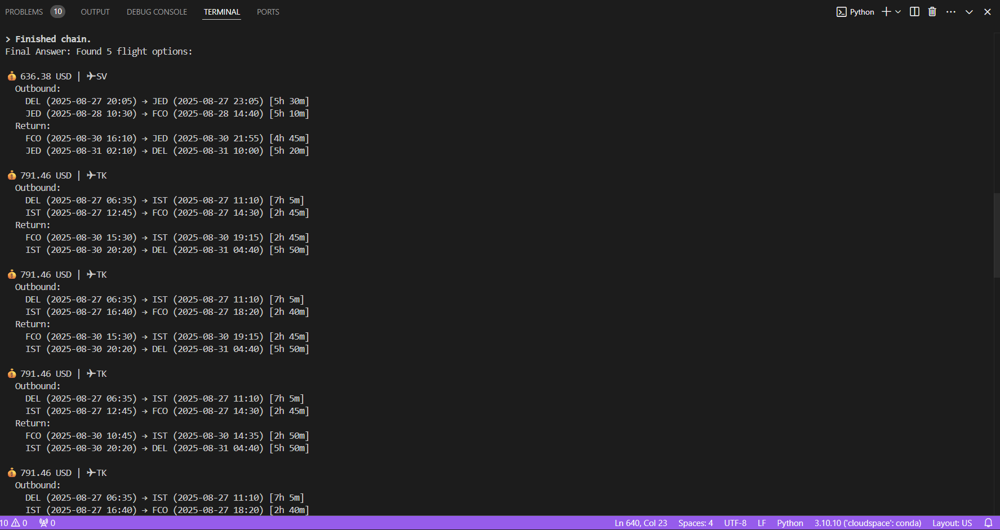
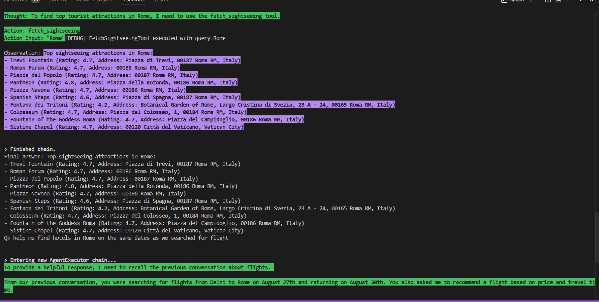
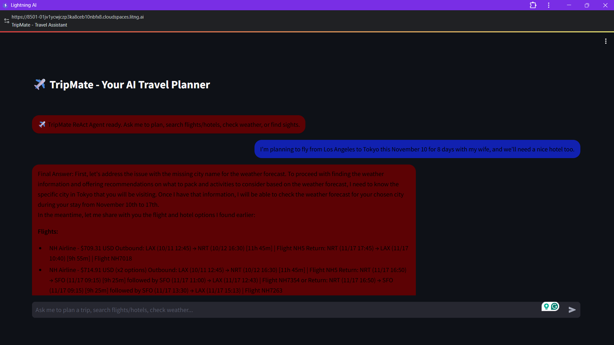
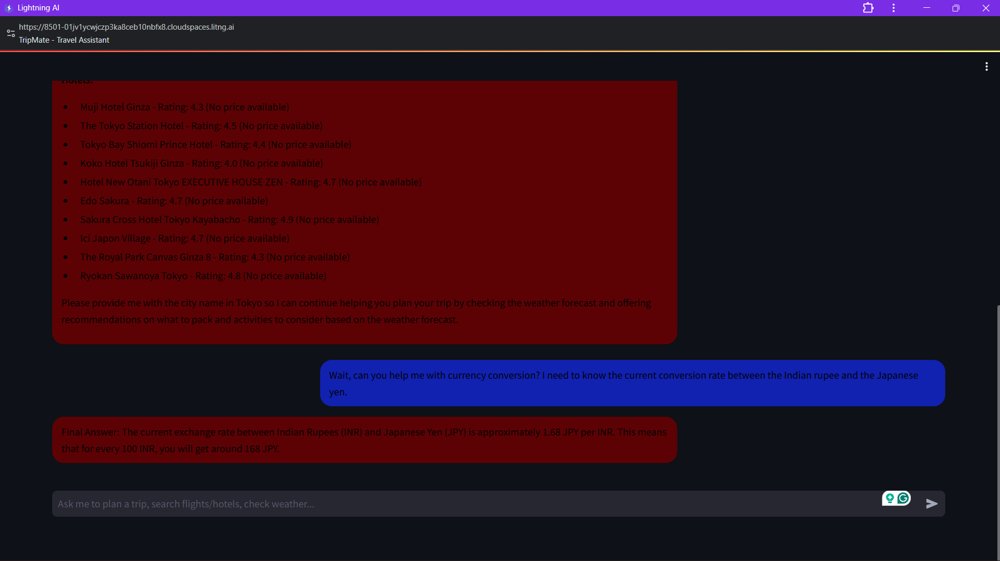
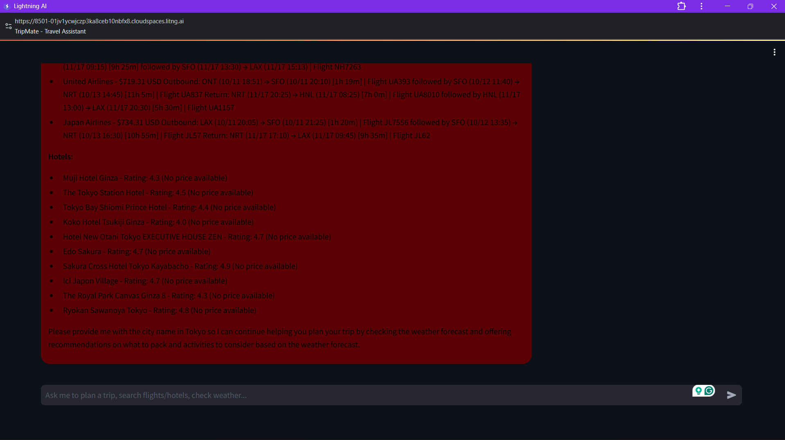

# 🧳 TripMate – AI Travel Planning Agent  

TripMate is an **AI-powered travel planning agent** built with [LangChain](https://www.langchain.com/), [Ollama](https://ollama.ai/), and multiple APIs.  
It follows the **ReAct (Reasoning + Action)** framework, using natural language queries to assist users in planning trips end-to-end.  

TripMate can:  
✅ Search for **Flights** (Amadeus API)  
✅ Find **Hotels** (Google Hotels via SerpAPI)  
✅ Fetch **Weather Forecasts** (OpenWeather API)  
✅ Suggest **Tourist Attractions** (Google Maps via SerpAPI)  
✅ Perform **Currency Conversion** (CurrencyAPI)  


## 📸 Demo Screenshots  

<table>
  <tr>
    <td>
      
      <p><strong>CL Interface 1:</strong> CLI Demonstration </p>
    </td>
    <td>
      
      <p><strong>CL Interface 2:</strong> CLI Demonstration </p>
    </td>
  </tr>
  <tr>
    <td>
      
      <p><strong>Steamlit Interface 1:</strong> Streamlit Web App </p>
    </td>
    <td>
      
      <p><strong>Steamlit Interface 2:</strong> Streamlit UI </p>
    </td>
  </tr>
</table>


### Streamlit Web App  



## ✨ Features  

- **Flight Search** ✈️ – Finds flights using Amadeus API.  
- **Hotel Search** 🏨 – Searches for hotels via SerpAPI Google Hotels.  
- **Weather Forecast** 🌦 – Fetches weather details for any city and date range using OpenWeather API.  
- **Sightseeing Suggestions** 🗺 – Suggests top attractions via SerpAPI Google Maps.  
- **Currency Conversion** 💱 – Converts between currencies using CurrencyAPI.  
- **Conversational Memory** 🧠 – Maintains trip context across queries (e.g., city, dates, preferences).  
- **LLM Reasoning** 🤖 – Uses [Ollama](https://ollama.ai/) models (e.g., Mistral, LLaMA) for natural language understanding and JSON extraction.  

---

## 🏗 Tech Stack  

- **Python 3.10+**  
- [LangChain](https://www.langchain.com/) (Core, Agents, Tools, Memory)  
- [Ollama](https://ollama.ai/) – Local LLM for reasoning/extraction
- [Streamlit] - For a simple web app-based User Interface
- **APIs integrated:**  
  - [Amadeus](https://developers.amadeus.com/) – Flight search  
  - [SerpAPI](https://serpapi.com/) – Hotels & sightseeing  
  - [OpenWeather](https://openweathermap.org/) – Weather forecasts  
  - [CurrencyAPI](https://currencyapi.com/) – Currency conversion  
  - [Google Maps](https://developers.google.com/maps) – Place lookups  

---

---

## ⚙️ Features

- **Natural language understanding** – just type queries like  
  *"Find me flights from Mumbai to Paris on 12th October returning 20th October"*  
- **Integrated memory** – remembers trip details (origin, destination, dates, preferences) during conversation.  
- **ReAct framework** – Think → Act (tool call) → Observe → Final Answer.  
- **Multiple APIs** combined seamlessly.  
- **Terminal & Streamlit support** – run in CLI or web interface.  

---

## 📦 Installation

Clone the repository and install dependencies:

```bash
git clone https://github.com/your-username/tripmate.git
cd tripmate
pip install -r requirements.txt

```

## Run CLI Travel Assistant
```bash
python travel_planner.py
```

## 🚀 Run Streamlit App
```bash
streamlit run --server.port 8501 app.py
```


